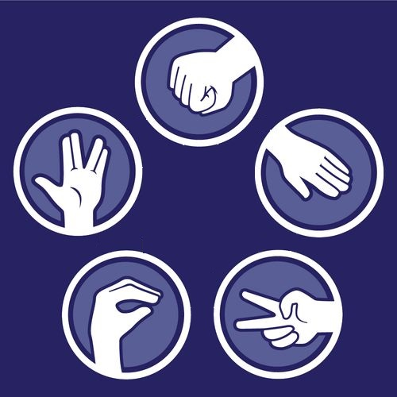
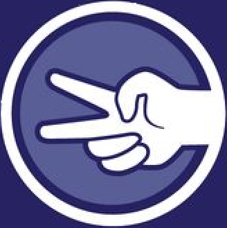

<h1>Projeto de TAI com Teachable Machine</h1>

<h2>Sobre</h2>

Basicamente, utilizando o machine learning do Teachable Machine criamos nossa versão do Pedra-papel-tesoura-lagarto-Spock, que é uma expansão do clássico método de seleção em jogo de pedra-papel-tesoura. Ele é muito parecido porém inclui outras duas armas adicionais: o lagarto e Spock.
O site não é suporta jogar com outros jogadores simultâneos, mas sim, contra uma máquina.

<h2>Como Funciona</h2>

Para poder iniciar o jogo, é necessário clicar no botão "Permitir camera". Após isso, o usuário deve escolher uma das 5 armas e fazer o sinal desejado com as mãos:
 

 
Pedra:
 

 
Papel:
 

 
Tesoura:
 

 
Lagarto:
 

 
Spoke: 
 

 

<h2>Regras:</h2>
 
Pedra ganha de Lagarto e Tesoura;
 
Papel ganha de Pedra e Spoke;
 
Tesoura ganha de Papel e Lagarto;
 
Lagarto ganha de Papel e Spoke;
 
Spoke ganha de Pedra e Tesoura.
 

